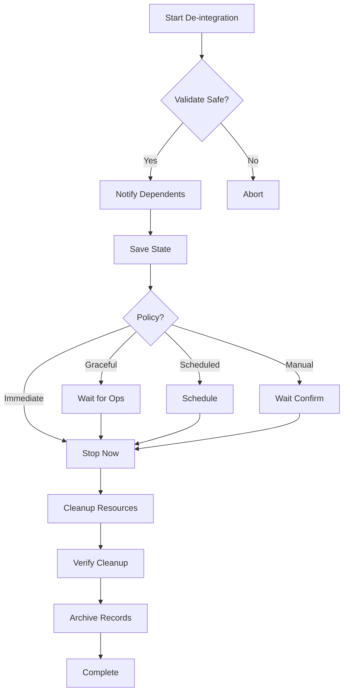

# Integration & De-integration Guide

## 🔗 Overview

AutoWeave Backend supports dynamic integration and de-integration of external services, tools, and platforms. This guide explains the concepts, architecture, and best practices.

## 📋 Table of Contents

1. [Concepts](#concepts)
2. [Integration Architecture](#integration-architecture)
3. [De-integration System](#de-integration-system)
4. [Implementation Guide](#implementation-guide)
5. [Best Practices](#best-practices)
6. [Examples](#examples)

## 🧩 Concepts

### What is Integration?

Integration in AutoWeave means:
- **Connecting** external services to the AutoWeave ecosystem
- **Adapting** different protocols and APIs to a common interface
- **Managing** lifecycle of connections and resources
- **Monitoring** health and performance of integrated services

### What is De-integration?

De-integration is the **controlled removal** of an integration:
- **Graceful shutdown** of connections
- **State preservation** for potential re-integration
- **Resource cleanup** to prevent leaks
- **Dependency notification** to prevent cascading failures

### Why De-integration Matters

1. **Clean Architecture**: Remove unused integrations without residue
2. **Resource Management**: Free up memory, connections, and storage
3. **Flexibility**: Swap integrations in/out based on needs
4. **Debugging**: Isolate issues by removing integrations
5. **Compliance**: Remove integrations for regulatory reasons

## 🏗️ Integration Architecture

### Components

```
┌─────────────────────────────────────────────────┐
│              Integration Hub                     │
├─────────────────────────────────────────────────┤
│                                                 │
│  ┌──────────────┐    ┌────────────────────┐   │
│  │ Integration  │    │  De-integration    │   │
│  │   Manager    │◄──►│     Manager        │   │
│  └──────────────┘    └────────────────────┘   │
│         │                      │               │
│         ▼                      ▼               │
│  ┌──────────────┐    ┌────────────────────┐   │
│  │   Adapters   │    │   State Storage    │   │
│  │              │    │                    │   │
│  │ • REST API   │    │ • Configuration    │   │
│  │ • WebSocket  │    │ • Session Data     │   │
│  │ • GraphQL    │    │ • Metrics          │   │
│  │ • Custom     │    │ • History          │   │
│  └──────────────┘    └────────────────────┘   │
│                                                 │
└─────────────────────────────────────────────────┘
```

### Integration Lifecycle

1. **Registration** → 2. **Initialization** → 3. **Active** → 4. **De-integration** → 5. **Archived**

## 🔄 De-integration System

### De-integration Policies

#### 1. Immediate
```javascript
{
  policy: 'immediate',
  preserveData: false
}
```
- Stops everything immediately
- No grace period
- Use for emergencies

#### 2. Graceful (Recommended)
```javascript
{
  policy: 'graceful',
  preserveData: true
}
```
- Waits for active operations
- Saves state for re-integration
- Notifies dependent services

#### 3. Scheduled
```javascript
{
  policy: 'scheduled',
  scheduledTime: new Date('2025-01-01')
}
```
- Defers de-integration
- Allows planning
- Good for migrations

#### 4. Manual
```javascript
{
  policy: 'manual'
}
```
- Requires confirmation
- For critical integrations
- Adds safety layer

### De-integration Process



## 🛠️ Implementation Guide

### Creating an Adapter

```javascript
export default class MyServiceAdapter extends EventEmitter {
  constructor({ config, logger }) {
    super();
    this.config = config;
    this.logger = logger;
    this.name = 'my-service';
    this.version = '1.0.0';
  }

  // Required: Initialize connection
  async init() {
    // Connect to service
    this.connected = true;
    this.emit('connected');
  }

  // Required: Process incoming data
  async processData(data) {
    // Handle different data types
    switch(data.type) {
      case 'action':
        return await this.performAction(data.payload);
    }
  }

  // Required: Health check
  async healthCheck() {
    return {
      healthy: this.connected,
      details: { /* service-specific health */ }
    };
  }

  // Required: Save state for de-integration
  async saveState() {
    return {
      config: this.config,
      sessions: this.sessions,
      // Any data needed for restoration
    };
  }

  // Required: Cleanup resources
  async cleanup() {
    // Close connections
    // Clear caches
    // Release resources
    this.connected = false;
  }

  // Optional: Restore from saved state
  async restoreState(state) {
    this.config = state.config;
    this.sessions = state.sessions;
    // Restore service-specific state
  }
}
```

### Registering an Integration

```javascript
const integration = await hub.registerIntegration({
  name: 'my-service',
  type: 'api',
  adapter: {
    type: 'my-service',
    config: {
      apiUrl: 'https://api.example.com',
      apiKey: process.env.MY_SERVICE_KEY
    }
  },
  metadata: {
    description: 'My service integration',
    version: '1.0.0',
    features: ['feature1', 'feature2']
  }
});
```

### De-integrating Safely

```javascript
// Always check for active operations first
const status = await hub.getIntegrationStatus(integrationId);

if (status.activeOperations > 0) {
  console.log('Warning: Active operations in progress');
}

// Perform de-integration
const deintegration = await deintegrationManager.deintegrate(
  integrationId,
  {
    policy: 'graceful',
    preserveData: true,
    notifyDependents: true
  }
);
```

## 📚 Best Practices

### Integration Best Practices

1. **Always implement saveState()**
   - Critical for de-integration
   - Enables state recovery
   - Include configuration and runtime data

2. **Use event emitters**
   - Notify hub of state changes
   - Enable real-time monitoring
   - Support reactive workflows

3. **Implement robust error handling**
   - Graceful degradation
   - Automatic reconnection
   - Clear error messages

4. **Version your adapters**
   - Track compatibility
   - Support migrations
   - Enable rollbacks

### De-integration Best Practices

1. **Default to graceful policy**
   - Prevents data loss
   - Maintains system stability
   - Respects dependencies

2. **Always preserve data for critical integrations**
   - Enables recovery
   - Provides audit trail
   - Supports debugging

3. **Test de-integration in development**
   - Verify cleanup completeness
   - Check for resource leaks
   - Test re-integration

4. **Monitor de-integration process**
   - Track progress
   - Handle failures
   - Log all steps

5. **Document dependencies**
   - Prevent orphaned services
   - Enable impact analysis
   - Support planning

## 📋 Examples

### Example 1: Database Integration

```javascript
// Integration
const dbIntegration = await hub.registerIntegration({
  name: 'postgres-analytics',
  type: 'database',
  adapter: {
    type: 'postgres',
    config: {
      host: 'localhost',
      database: 'analytics',
      pool: { min: 2, max: 10 }
    }
  }
});

// Usage
await hub.processIntegrationData(dbIntegration.id, {
  type: 'query',
  payload: {
    sql: 'SELECT * FROM events WHERE date > ?',
    params: ['2025-01-01']
  }
});

// De-integration (graceful with connection draining)
await deintegrationManager.deintegrate(dbIntegration.id, {
  policy: 'graceful',
  preserveData: true
});
```

### Example 2: API Integration with Rate Limiting

```javascript
class RateLimitedAPIAdapter extends BaseAdapter {
  constructor(config) {
    super(config);
    this.requestQueue = [];
    this.rateLimit = config.rateLimit || 100;
  }

  async cleanup() {
    // Wait for queue to empty
    while (this.requestQueue.length > 0) {
      await new Promise(resolve => setTimeout(resolve, 1000));
    }
    
    // Then cleanup
    await super.cleanup();
  }
}
```

### Example 3: Scheduled De-integration

```javascript
// Schedule de-integration for maintenance window
const maintWindow = new Date('2025-01-15T02:00:00Z');

await deintegrationManager.deintegrate(integrationId, {
  policy: 'scheduled',
  scheduledTime: maintWindow,
  preserveData: true,
  notification: {
    email: 'ops@example.com',
    message: 'Scheduled maintenance de-integration'
  }
});
```

## 🔍 Monitoring & Debugging

### Integration Metrics

- **Connection Status**: Up/Down/Reconnecting
- **Operation Count**: Total, Active, Failed
- **Response Time**: Average, P95, P99
- **Error Rate**: Errors per minute
- **Resource Usage**: Memory, Connections

### De-integration Metrics

- **Duration**: Time to complete
- **Steps Completed**: Success/Failure per step
- **Data Preserved**: Size and location
- **Dependencies Notified**: Count and status
- **Resources Released**: Memory, handles, connections

### Debugging Commands

```bash
# Check integration status
curl http://localhost:3001/api/integration/{id}/status

# View de-integration history
curl http://localhost:3001/api/integration/deintegrations

# Force cleanup (emergency)
curl -X POST http://localhost:3001/api/integration/{id}/force-cleanup
```

## 🚀 Advanced Topics

### Hot-swapping Integrations

Replace an integration without downtime:

```javascript
// 1. Register new version
const newIntegration = await hub.registerIntegration({...});

// 2. Migrate traffic
await hub.migrateTraffic(oldId, newId, { percentage: 100 });

// 3. De-integrate old version
await deintegrationManager.deintegrate(oldId);
```

### Integration Chains

Link integrations for complex workflows:

```javascript
const chain = await hub.createIntegrationChain([
  { id: 'data-source', type: 'input' },
  { id: 'transformer', type: 'process' },
  { id: 'destination', type: 'output' }
]);

// De-integrate entire chain
await deintegrationManager.deintegrateChain(chain.id);
```

### State Migrations

Migrate state between adapter versions:

```javascript
class MyAdapterV2 extends MyAdapter {
  async restoreState(state) {
    if (state.version === '1.0.0') {
      state = this.migrateV1ToV2(state);
    }
    await super.restoreState(state);
  }
}
```

## 📝 Summary

The Integration & De-integration system in AutoWeave provides:

- **Flexibility**: Add/remove services dynamically
- **Reliability**: Graceful handling of connections
- **Maintainability**: Clean architecture with no residue
- **Recoverability**: State preservation and restoration
- **Observability**: Comprehensive monitoring and logging

By following this guide, you can create robust integrations that can be safely added and removed from the AutoWeave ecosystem.